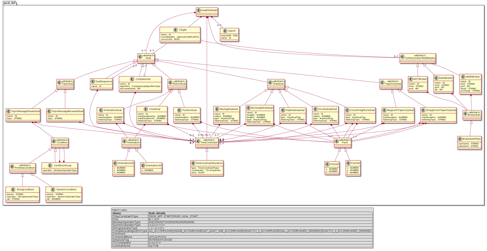

# goal-dsl

Domain-Specific Language for evaluation of IoT applications and system behavior, 
based on **Goals**.

The general idea is that we can define goal rules based on messages arrived
at specific topics. For example, a goal may define a rule to wait until receive an event
or a message on a topic.

To expand this idea to the context of Cyber-Physical Systems, beyond
topic-related Goals, it is useful to be able to define environment-related Goals
for mobile things, such as robots. For example, in robotics it is common
to require definition of Goals related to the Pose of the robot, or to follow a trajectory.

**Goal Types**:
- Topic Goals
- Area Goals
- Pose Goals
- Trajectory Goals

## Goal Types

### Topic Goals

#### TopicMessageReceivedGoal
This Goal is considered **REACHED** when a message arrives at a specific topic,
without any considerations of the payload of the message.

#### TopicMessageParamGoal
Set this Goal for cases where you want to filter messages arrived at a topic
based on the value of a param (using an expression).

### Area Goals

An **AreaGoal** can be of type `AVOID` (DANGER ZONE) or `REACH` (HAPPY ZONE).
The first defines area goals which have to be avoided by mobile things, while
the latter have to be reached. The type is a property of all area goals.

#### RectangleAreaGoal
A rectangle area defined by (centerPoint, radius) that has to either be reached
or avoided.

#### CircularAreaGoal
A circular area defined by (centerPoint, radius) that has to be either reached
or avoided.

#### StraightLineAreaGoal
A straight line defined by (startPoint, finishPoint) that has to be either
reached or avoided.

### Pose Goals

Pose goals are those related to the pose of a specific thing.
Mostly used in mobile robot applications.

#### PointGoal
Reach a specific point in space.

#### OrientationGoal
Reach a specific orientation in space.

#### PoseGoal
Reach a specific pose (orientation, position) in space.

### Trajectory Goals

Use this type to define goals for a thing to follow/track a trajectory. Mostly used in mobile robot applications.

#### StraightLineTrajectoryGoal
A straight line trajectory goal, defined by (startPoint, finishPoint,
    maxDeviation).

#### CustomPointsTrajectoryGoal
A straight line trajectory goal, defined by (startPoint, finishPoint,
    trajectoryPoints, maxDeviation).

## Metamodel of the Language

The metamodel of the DSL, defines the concepts of the language.

## Grammar

## Examples

# Credits

- [klpanagi](https://github.com/klpanagi)
- [imgchris]()
- [etsardou]()
- [asymeo]()